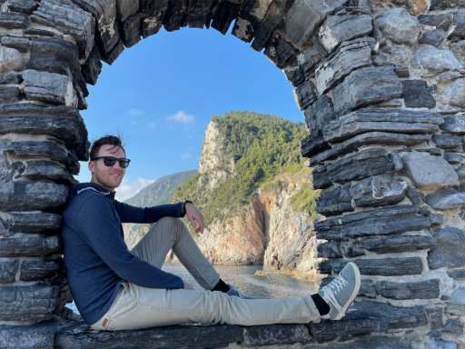

# iOS Portfolio

### Hi 👋, I'm Giordano Menegazzi
###### iOS Developer - Engineer - YouTuber

This is my iOS portfolio, the full website can be viewed at [https://giordano-menegazzi.github.io/](https://giordano-menegazzi.github.io/).
Here you can see all iOS apps I created, all apps are fully programmatically created and documented here on my github page [GitHub](https://github.com/Giordano-Menegazzi) as well.
This iOS portfolio website is created with the free [GoHugo](https://gohugo.io/) website template from [Radity](https://radity.com/).

### License
- Copyright 2020 Radity [Radity](https://radity.com/).
- Licensed under MIT [License](https://github.com/radity/raditian-free-hugo-theme/blob/master/LICENSE).
- Free [Template](https://themes.gohugo.io/themes/raditian-free-hugo-theme/) used for this site. 
